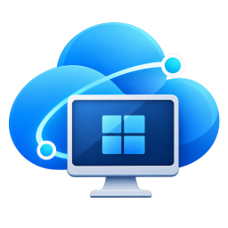

<p align="center">
  
</p>

<h1 align="center">Vindauga</h1>

<p align="center">
  A native Linux client for Azure Virtual Desktop and Windows 365.<br>
  Import an <code>.rdp</code> file once, then connect with one click.
</p>

<p align="center">
  <a href="https://github.com/ETroll/Vindauga/releases/latest">Download</a> ·
  <a href="#getting-your-rdp-file">Getting your .rdp file</a> ·
  <a href="#building-from-source">Building from source</a>
</p>

---

*Vindauga* is the Old Norse word for window ("wind-eye"). The project is a C++20 / Qt 6 Quick application built on [FreeRDP 3](https://www.freerdp.com/), made for people who use Azure Virtual Desktop (AVD) or a Windows 365 Cloud PC from a Linux desktop and want something that simply works: no terminal, no hand-edited command lines, no browser tab pretending to be a desktop.

It is built and tested primarily on Wayland (Hyprland, KDE Plasma) and also runs on X11.

## Features

- **Saved connections.** Import the `.rdp` file Microsoft gives you once. Vindauga remembers it and shows it as a card you connect to with a single click.
- **Sign-in the way Microsoft expects.** The Entra ID (Azure AD) login, including MFA, happens in an embedded web view inside the app. No copying of URLs or codes.
- **Credentials stay in your keyring.** The username and password for the desktop sign-in are stored through the system keyring (GNOME Keyring, KWallet or any Secret Service provider), never in plain files. Sign-in tokens are kept in memory only.
- **Hardware video decoding.** H.264 streams from the session are decoded on the GPU through VA-API when available, with a device picker for hybrid-GPU laptops.
- **HiDPI aware.** Optionally tells Windows inside the session to scale to your display's real pixel density.
- **Dynamic resolution.** Resizing the window resizes the remote desktop.
- **Tunable smoothness.** A small, configurable frame buffer smooths bursts of screen updates at the cost of a few milliseconds of latency.

## Installation

Packages for each release are published on the [releases page](https://github.com/ETroll/Vindauga/releases/latest).

**Ubuntu 24.04 and derivatives** (Pop!_OS, Kubuntu, Linux Mint 22, KDE neon). The `.deb` bundles a recent Qt, because the Qt shipped by Ubuntu 24.04 is too old; it depends on the distribution's FreeRDP 3.

```bash
sudo apt install ./vindauga_<version>_amd64.deb
```

**Arch Linux** and derivatives:

```bash
sudo pacman -U vindauga-<version>-1-x86_64.pkg.tar.zst
```

Afterwards, "Vindauga" appears in your application menu.

## Getting your .rdp file

Vindauga does not enumerate your desktops for you. Instead it uses the standard `.rdp` file that Microsoft's own web client provides, which works for every AVD and Windows 365 tenant.

1. Open <https://windows.cloud.microsoft> in a browser and sign in with your work account.
2. Open **Settings** (gear icon) and, under **Resources launch method**, choose **Download the RDP file**.
3. Select the desktop or Cloud PC you want to use. Instead of opening it in the browser, the web client now downloads an `.rdp` file. Save it somewhere convenient.
4. In Vindauga, click **Import .rdp...** and select the file.

The connection is now saved. The next time you connect, only the sign-in prompt appears, and only when your tenant requires it. This has been tested with Azure Virtual Desktop host pools; Windows 365 uses the same web client and file format, but has not been verified. If the download option is missing or disabled, ask your IT department for the `.rdp` file for your desktop; any `.rdp` file that works with Microsoft's Windows App works here too.

## Usage notes

- **Settings** (gear icon) lets you toggle HiDPI scaling, hardware decoding and the GPU device, and set the frame buffer length.
- **Logs** are written to `~/.local/state/vindauga/vindauga.log`. Start the app from a terminal with `vindauga --log-terminal --log-level=debug` to see them live. Secrets are never logged.
- **Keyboard layout on X11.** If your X server advertises a keyboard variant that does not exist in the installed xkeyboard-config (for example `no(win)` instead of `no(winkeys)`), the embedded browser used for sign-in would crash. Vindauga detects this at startup, repairs the advertised layout and logs a warning telling you how to fix your system configuration permanently.

## Building from source

Requirements: CMake 3.21+, Ninja, a C++20 compiler, Qt 6.9 or newer (Core, Quick, QuickControls2, NetworkAuth, WebEngineQuick, ShaderTools), FreeRDP 3 development files, QtKeychain for Qt 6, libxkbcommon and libxcb development files.

**Arch Linux**

```bash
sudo pacman -S --needed cmake ninja qt6-base qt6-declarative qt6-networkauth qt6-webengine qt6-shadertools qtkeychain-qt6 freerdp
cmake --preset debug
cmake --build --preset debug
ctest --preset debug
```

**Ubuntu 24.04**

Ubuntu's Qt is older than 6.9, so install Qt with [aqtinstall](https://github.com/miurahr/aqtinstall) and point CMake at it. QtKeychain must then be built against that Qt as well.

```bash
sudo apt install cmake ninja-build pkg-config freerdp3-dev libgl1-mesa-dev libxkbcommon-dev libxcb1-dev libsecret-1-dev
pip install --user aqtinstall
aqt install-qt linux desktop 6.9.1 linux_gcc_64 -m qtnetworkauth qtwebengine qtwebchannel qtpositioning qtshadertools -O ~/Qt

git clone --branch v0.14.0 --depth 1 https://github.com/frankosterfeld/qtkeychain.git ~/src/qtkeychain
cmake -S ~/src/qtkeychain -B ~/src/qtkeychain/build -G Ninja -DCMAKE_BUILD_TYPE=Release \
  -DCMAKE_PREFIX_PATH=$HOME/Qt/6.9.1/gcc_64 -DCMAKE_INSTALL_PREFIX=$HOME/qtkeychain-qt6 \
  -DBUILD_WITH_QT6=ON -DBUILD_TRANSLATIONS=OFF -DLIBSECRET_SUPPORT=ON
cmake --build ~/src/qtkeychain/build && cmake --install ~/src/qtkeychain/build

export CMAKE_PREFIX_PATH="$HOME/Qt/6.9.1/gcc_64:$HOME/qtkeychain-qt6"   # colon-separated
cmake --preset debug
cmake --build --preset debug
ctest --preset debug
```

The packaging scripts under `packaging/` (`build-deb.sh`, `PKGBUILD`) are what the release workflow runs and double as a reference for a complete build.

## How it works, briefly

The RDP session itself is standard RDP over Microsoft's Azure gateway, driven by libfreerdp. Everything around it is Qt: the Quick UI, the embedded WebEngine view that hosts the Entra ID sign-in, and QtKeychain for credential storage. Frames are uploaded to a persistent GPU texture in the Qt scene graph, so only the regions that changed are re-uploaded.

Layering: `src/core` (session, auth, storage; uses QtGui for `QImage` but nothing from Qt Quick), `src/ui` (Qt Quick UI and backends), `src/app` (the executable). Tests live in `tests/`.

## License

Vindauga is released under the [MIT License](LICENSE). It links against Qt (LGPL 3) and FreeRDP (Apache 2.0); the `.deb` package bundles Qt as shared libraries, which you may replace with your own build.
